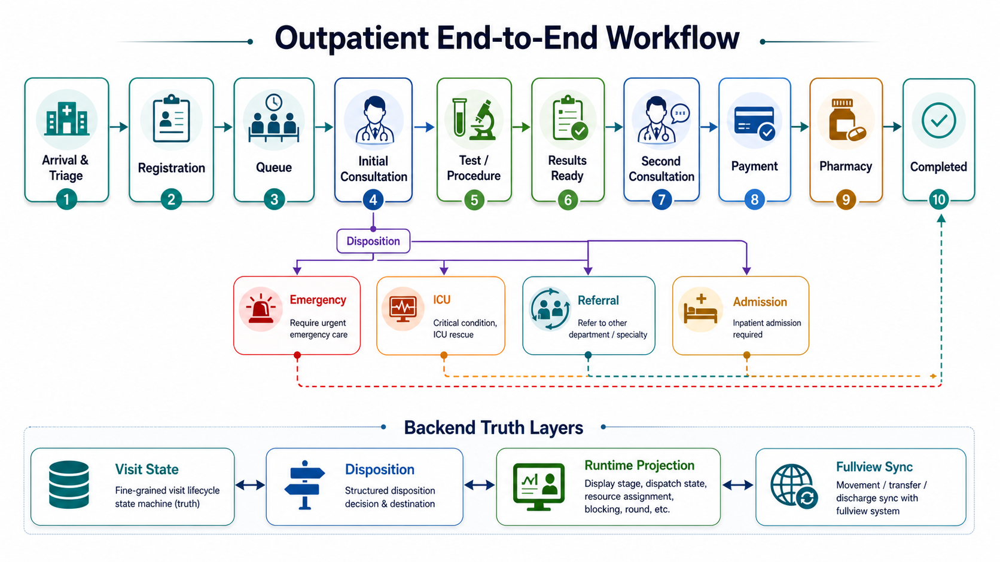

# Hospital Agent Simulation

## Overview
This project is a hospital outpatient simulation system with a FastAPI backend as the source of truth, explicit patient and visit state machines, department runtime projections, and multiple control and display surfaces for triage, consultation, testing, payment, disposition, and hospital-wide visualization.

## Workflow Diagram



For the Chinese collaboration handoff and showcase-dashboard explanation, start with [docs/门诊系统总览与前端展示接口说明.md](docs/门诊系统总览与前端展示接口说明.md). That document explains the outpatient chain, backend truth layers, and why a richer showcase GUI should evolve from `department-runtime-debug` rather than the single-patient `scene/` page.

## Visit State Transition Diagram

This diagram summarizes the current main transitions in `backend/app/domain/visit/state_machine.py`. Read it together with `disposition` and `runtime projection`; the display layer is not the same thing as the visit truth state.

```mermaid
flowchart LR
    subgraph Triage["Triage"]
        arrived["arrived"]
        registration_pending["registration_pending"]
        triaging["triaging"]
        waiting_followup["waiting_followup"]
        triaged["triaged"]
    end

    subgraph Consult["Registration / Consultation"]
        registered["registered"]
        waiting_consultation["waiting_consultation"]
        in_consultation["in_consultation"]
    end

    subgraph Testing["Testing Path"]
        waiting_test["waiting_test"]
        waiting_test_payment["waiting_test_payment"]
        test_payment_completed["test_payment_completed"]
        in_test["in_test"]
        waiting_return_consultation["waiting_return_consultation"]
        results_ready["results_ready"]
    end

    subgraph Procedure["Outpatient Procedure"]
        waiting_outpatient_procedure["waiting_outpatient_procedure"]
        in_outpatient_procedure["in_outpatient_procedure"]
    end

    subgraph ReturnFlow["Diagnosis / Disposition"]
        waiting_second_consultation["waiting_second_consultation"]
        in_second_consultation["in_second_consultation"]
        diagnosis_finalized["diagnosis_finalized"]
        waiting_payment["waiting_payment"]
        medical_payment_completed["medical_payment_completed"]
        disposition_pending["disposition_pending"]
    end

    subgraph Endings["Disposition / Terminal"]
        waiting_pharmacy["waiting_pharmacy"]
        disposition_outpatient_treatment["disposition_outpatient_treatment"]
        disposition_followup_booking["disposition_followup_booking"]
        disposition_referral["disposition_referral"]
        admitted["admitted"]
        transferring["transferring"]
        completed["completed"]
        in_emergency["in_emergency"]
        in_icu_rescue["in_icu_rescue"]
    end

    arrived -->|begin_triage| triaging
    registration_pending -->|begin_triage| triaging
    triaging -->|begin_triage / resume_triage| triaging
    triaging -->|followup_requested| waiting_followup
    triaging -->|triage_completed| triaged
    waiting_followup -->|begin_triage / resume_triage| triaging
    waiting_followup -->|followup_requested| waiting_followup
    waiting_followup -->|triage_completed| triaged
    triaged -->|triage_completed| triaged
    triaged -->|register_completed| registered
    triaged -->|route_to_emergency| in_emergency
    triaged -->|route_to_icu_rescue| in_icu_rescue
    triaged -->|begin_triage| triaging

    registered -->|queue_wait_elapsed| waiting_consultation
    waiting_consultation -->|start_consultation| in_consultation
    waiting_consultation -->|complete_visit| completed
    in_consultation -->|consultation_completed| waiting_test
    in_consultation -->|order_outpatient_procedure| waiting_outpatient_procedure
    in_consultation -->|finalize_without_tests| diagnosis_finalized
    in_consultation -->|complete_visit| completed

    waiting_test -->|request_test_payment| waiting_test_payment
    waiting_test -->|results_ready| results_ready
    waiting_test -->|order_outpatient_procedure| waiting_outpatient_procedure
    waiting_test -->|begin_triage| triaging
    waiting_test_payment -->|pay_test| test_payment_completed
    test_payment_completed -->|start_exam| in_test
    in_test -->|finish_exam| waiting_return_consultation
    waiting_outpatient_procedure -->|start_outpatient_procedure| in_outpatient_procedure
    in_outpatient_procedure -->|finish_outpatient_procedure| results_ready
    in_outpatient_procedure -->|order_tests| waiting_test
    waiting_return_consultation -->|results_ready| results_ready
    waiting_return_consultation -->|order_outpatient_procedure| waiting_outpatient_procedure
    results_ready -->|queue_second_consultation| waiting_second_consultation
    results_ready -->|start_second_consultation| in_second_consultation

    waiting_second_consultation -->|start_second_consultation| in_second_consultation
    in_second_consultation -->|finalize_diagnosis| diagnosis_finalized
    diagnosis_finalized -->|request_medical_payment| waiting_payment
    diagnosis_finalized -->|plan_disposition| disposition_pending
    waiting_payment -->|pay_medical| medical_payment_completed
    medical_payment_completed -->|plan_disposition| disposition_pending
    disposition_pending -->|choose_pharmacy| waiting_pharmacy
    disposition_pending -->|choose_outpatient_treatment| disposition_outpatient_treatment
    disposition_pending -->|choose_followup_booking| disposition_followup_booking
    disposition_pending -->|choose_referral| disposition_referral
    disposition_pending -->|admit_patient| admitted
    disposition_pending -->|route_to_emergency| in_emergency
    disposition_pending -->|route_to_icu_rescue| in_icu_rescue
    disposition_pending -->|complete_visit| completed
    waiting_pharmacy -->|dispense_medication / complete_visit| completed
    disposition_outpatient_treatment -->|complete_visit| completed
    disposition_followup_booking -->|complete_visit| completed
    disposition_referral -->|complete_visit| completed
    admitted -->|complete_visit| completed
    transferring -->|complete_visit| completed
```



States currently defined in enums but not part of the main `VISIT_TRANSITIONS` path above:
- `waiting_triage`
- `in_triage`
- `cancelled`

Current backend baseline:
- FastAPI provides the backend API, HTML control surfaces, and request-contract middleware.
- Patient lifecycle, visit lifecycle, disposition, and runtime projection are separated on purpose.
- Patient, visit, session, memory, queue, and runtime data are persisted locally.
- EventBus handles post-commit side effects, audit, and downstream synchronization.
- Active business agents include `triage`, `internal_medicine`, `surgery`, `icu_doctor`, `patient_agent`, and `test_simulator`.
- `hospital_supervisor` powers the mixed runtime used by `runtime-console`, `hospital-runtime-debug`, and `department-runtime-debug`.
- `scene/` remains the single-patient interaction frontend, while `department-runtime-debug` is the best current base for a richer showcase dashboard.
- `frontend/fullview/` and `fullview-sync-monitor` cover hospital-wide movement and visualization sync.

## Structure
- `backend/app/api/`: API routes
- `backend/app/agents/triage/`: triage agent graph, state, prompts, rules, service
- `backend/app/agents/internal_medicine/`: outpatient internal medicine agent
- `backend/app/agents/surgery/`: surgery outpatient agent and round-2 reassessment
- `backend/app/agents/icu_doctor/`: ICU consultation agent
- `backend/app/agents/patient_agent/`: controlled simulated patient agent
- `backend/app/agents/npc_patient/`: legacy NPC patient profile, planner, and runner
- `backend/app/agents/test_simulator/`: auxiliary test simulation service
- `backend/app/agents/interactive_debug/`: shared debug controllers, doctor debug registry, and presets
- `backend/app/agents/multi_patient_debug/`: multi-patient debug compatibility wrapper
- `backend/app/agents/department_runtime/`: department-centric runtime summaries and conclusions
- `backend/app/agents/clinical_policy/`: specialty policy and routing cards
- `backend/app/domain/patient/`: patient lifecycle state machine
- `backend/app/domain/visit/`: visit lifecycle state machine
- `backend/app/events/`: EventBus and subscribers
- `backend/app/repositories/`: persistence layer
- `backend/app/services/`: orchestration services, schedulers, flow engine, and projections
- `backend/app/services/npc_simulator.py`: background simulated patient loop
- `backend/app/services/hospital_supervisor.py`: mixed runtime supervisor used by formal runtime pages
- `backend/app/services/patient_flow_engine.py`: visit flow decision and execution engine
- `backend/app/services/department_runtime_service.py`: department runtime projection service
- `backend/app/services/runtime_projection.py`: UI-facing display-stage mapping and resource assignments
- `backend/app/services/patient_agent_service.py`: controlled patient agent service
- `backend/app/services/encounter_orchestration.py`: encounter coordination helpers
- `backend/app/services/scene_snapshot_service.py`: scene and runtime snapshot builder
- `backend/app/services/fullview_sync.py`: downstream movement and discharge sync helpers
- `backend/app/integrations/openemr/`: OpenEMR adapter layer
- `scene/`: browser scene and interaction modules
- `frontend/fullview/`: upstream frontend imported as a subtree
- `docs/门诊系统总览与前端展示接口说明.md`: Chinese overview for collaboration and showcase GUI design
- `docs/FRONTEND_SUBTREE_MAINTENANCE.md`: subtree sync and ownership guide
- `docs/AGENT_DEVELOPMENT_README.md`: how collaborators should add a new agent

## Backend Startup
```powershell
cd backend
python -m pip install -r requirements.txt
python server.py
```

Backend default URL:
- `http://127.0.0.1:8787`

## Runtime Console
- Formal backend runtime control console: `http://127.0.0.1:8787/runtime-console`
- Fullview synchronization monitor: `http://127.0.0.1:8787/fullview-sync-monitor`
- Purpose:
  - control total active patients
  - control active intelligent and scripted patient ratio
  - control independent spawn and step clocks for intelligent and scripted patients
  - inspect current issues, patients, department runtime state, and downstream sync health
- `runtime-console` is the formal control surface for backend scheduling.
- `fullview-sync-monitor` is the formal observer for downstream movement, transfer, and discharge delivery.
- Existing pages such as `hospital-runtime-debug` and `department-runtime-debug` remain available as compatibility and debug views.

## Backend Debug Entrypoints
one agent debug:
- http://127.0.0.1:8787/npc-debug

multi agent debug:
- http://127.0.0.1:8787/multi-patient-debug

agent dialogue debug:
- http://127.0.0.1:8787/triage-agent-debug
- http://127.0.0.1:8787/doctor-agent-debug
- http://127.0.0.1:8787/internal-medicine-agent-debug
- http://127.0.0.1:8787/patient-agent-debug
- http://127.0.0.1:8787/patient-agent-chat-debug
- http://127.0.0.1:8787/hospital-runtime-debug
- http://127.0.0.1:8787/department-runtime-debug

Notes:
- `runtime-console` is the formal session, config, and event-driven backend control console.
- `fullview-sync-monitor` is the formal inspection page for Fullview synchronization.
- `doctor-agent-debug` is the unified doctor-facing debug entrypoint.
- `internal-medicine-agent-debug` is kept as a compatibility alias backed by the unified doctor debug controller.
- The unified doctor debug stack already covers both `internal_medicine` and `surgery`.
- If you are designing a polished evaluator-facing GUI, use `department-runtime-debug` as the conceptual base rather than the single-patient `scene/` flow.

## Frontend Startup
```powershell
cd scene
python -m http.server 8000
```

Frontend URL:
- `http://127.0.0.1:8000`

## Current Flow
1. Player opens the triage form.
2. Frontend creates a triage session through `/api/v1/triage-sessions`.
3. Triage agent evaluates the case and may ask follow-up questions.
4. Registration and queue routes move the patient into `waiting_consultation` and then `in_consultation`.
5. The doctor lane can run either `internal_medicine` or `surgery`, with first-round consultation deciding among direct finalization, testing, outpatient procedure, or escalation.
6. Test and procedure branches update visit truth state first, then feed `runtime_projection` and department-level views.
7. Second consultation, payment, pharmacy, referral, ICU, emergency, or admission are handled as explicit backend disposition outcomes rather than a single generic "finished" step.
8. Frontend and debug pages consume queue, dialogue, department runtime, and medical-record projections; if the simulator is enabled, NPC and patient-agent flows are spawned and advanced in the background.
