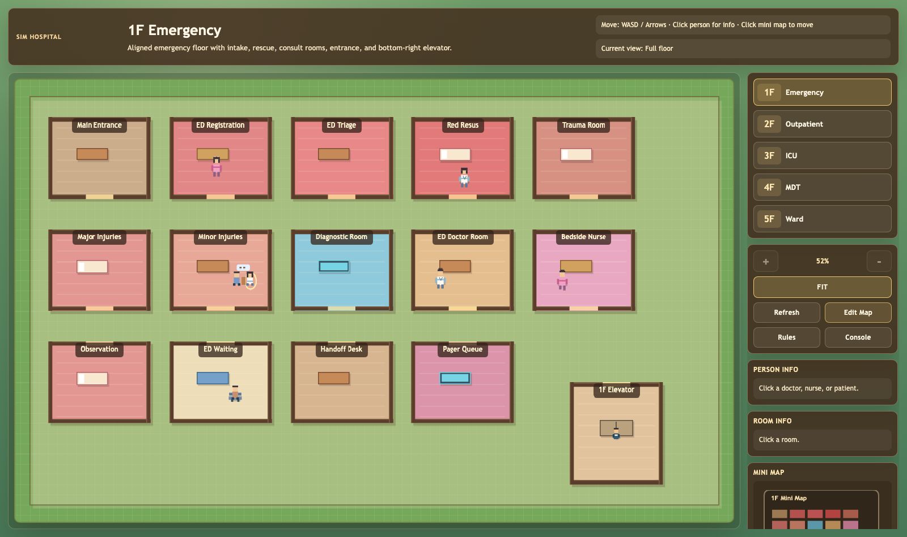
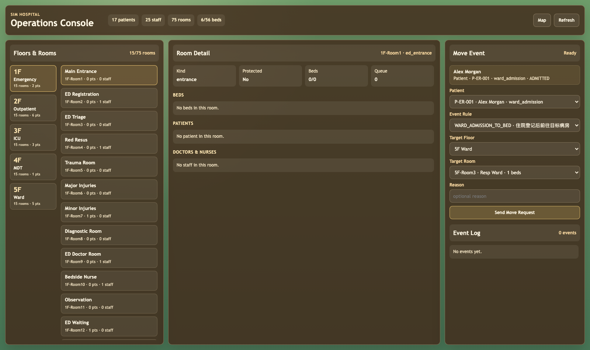
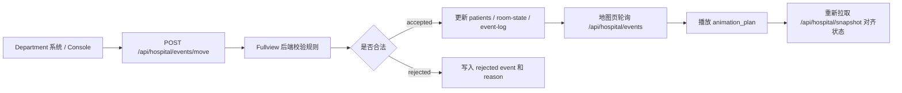

# SIM Hospital Fullview

面向 BME ICU 课程项目的全院统一可视化与调度核心系统。

Fullview 把门诊、急诊、ICU、住院部、MDT、检验科、药房等部门放到同一套医院地图、统一后端状态和统一事件规则中。各 department 后续不需要直接改地图前端，而是通过标准 API 请求患者移动、床位占用、检查转运等事件；Fullview 后端负责合法性判断、资源更新和事件记录，前端只负责展示当前状态和播放批准后的动画。

## 系统预览

### 全院地图



### Operations Console



## 核心功能

- **多楼层医院地图**：1F 急诊、2F 门诊/检验/药房、3F ICU、4F MDT、5F 住院部，支持楼层切换、缩放、Fit 视图和小地图。
- **统一人员展示**：患者、医生、护士、护工按统一 ID 与房间位置渲染；ICU/住院患者可显示为床上状态，门诊患者可显示为问诊或候诊状态。
- **房间与床位状态**：控制台可查看每层楼、每个房间、每张床的占用情况；空床也会显示唯一 `bed_id`。
- **后端驱动事件**：控制台或 department 发送移动请求，后端根据规则、患者位置、目标房间、床位和转运资源判断是否合法。
- **移动动画复用**：地图页轮询后端事件日志，只播放后端批准的 `animation_plan`，并在动画结束后重新同步 snapshot。
- **地图编辑**：通过 `Edit Map` 新增/删除房间、调整可编辑房间床位数；电梯等保护房间不能删除。
- **规则编辑**：通过 `Rules` 编辑患者移动规则，维护跨科室转运、检查、住院、ICU、出院等流程。
- **Operations Console**：全局查看房间、人员、资源和事件日志，也可以手动发送移动事件，模拟后续 department 自动接入。

## 快速启动

```bash
cd hospital/full_view
python dev-server.py 8000
```

打开：

```text
http://localhost:8000/
http://localhost:8000/console.html
```

如果 8000 端口被占用，可以换成其他端口：

```bash
python dev-server.py 8001
```

然后访问：

```text
http://localhost:8001/
http://localhost:8001/console.html
```

`dev-server.py` 是当前课程演示用的轻量 mock 后端，不需要数据库和第三方 Python 依赖。它会读取并写回 JSON 文件，适合本地联调和课堂展示。

## 目录结构

```text
hospital/
├── README.md                         # 仓库总说明
├── docs/
│   ├── assets/                       # README 截图资源
│   └── fullview-integration-manual.md # department 接入手册
├── full_view/
│   ├── index.html                    # 全院地图页面
│   ├── console.html                  # Operations Console
│   ├── dev-server.py                 # 轻量后端与静态服务
│   ├── map-config.json               # 楼层、房间、家具、床位布局
│   ├── backend-data/                 # 患者、医护、房间资源、事件日志
│   ├── event-rules/                  # 后端读取的移动规则 JSON
│   ├── API.md                        # API 详细说明
│   └── HOSPITAL_CORE_STANDARD.md     # 全院统一数据标准
└── rules/
    └── README.md                     # 规则维护说明
```

## 运行逻辑



核心原则：

- 后端是患者、房间、床位、规则和事件的权威。
- 前端不判断业务是否合法，只展示 snapshot 和 approved event。
- Department 可以保留自己的内部模型，但接入 Fullview 时必须转换成 Fullview 的统一 ID 和 API 格式。

## 常见维护操作

### 新建或删除病房

1. 打开地图页：`http://localhost:8000/`。
2. 点击右侧 `Edit Map`。
3. 选择楼层，输入房间名并添加房间。
4. 系统会自动生成唯一房间 ID。
5. 删除房间时点击房间右侧删除按钮。
6. 点击 `Save` 写回 `full_view/map-config.json`。

注意：电梯和被标记为 `protected` 的房间不能删除，避免破坏跨楼层路径和核心流程。

### 新建或减少病床

1. 打开 `Edit Map`。
2. 找到 ICU、Ward、Emergency、Rescue 等支持床位编辑的房间。
3. 使用床位加减按钮调整数量。
4. 点击 `Save`。

床位会生成稳定的 `bed_id`，格式通常为：

```text
{room_id}-bed-{nn}
```

例如：

```text
icu_beds_a-bed-01
resp_ward-bed-03
```

ICU 和住院部患者临时去检查时，原床位会被保留，不能分配给其他患者；只有出院或转到其他长期床位时，原床才会释放。

### 新建移动规则

1. 打开地图页，点击 `Rules`。
2. 选择规则分类，例如 `outpatient`、`emergency`、`icu`、`ward` 或 `transfer`。
3. 点击添加规则。
4. 填写稳定的 `event_id` / `eventId`。
5. 填写 `movement` JSON：来源、目标、途经电梯、交通方式、陪同人员、设备、最终显示形态。
6. 点击 `Save` 写回规则 JSON。

规则的作用是告诉后端：某种事件在什么条件下允许发生、需要经过哪些房间、是否需要床位、是否需要护工/护士陪同、前端最终应该如何展示患者。

一个典型 ICU 转运规则会包含：

```json
{
  "eventId": "ED_TO_ICU_MOVE",
  "movement": {
    "schema": "patient-move",
    "from": "current_ed_room",
    "to": "icu_admission",
    "via": ["ed_handoff", "elevator_1", "elevator_3"],
    "transport": "stretcher",
    "patientFormDuringMove": "stretcher",
    "finalForm": "bed",
    "escortRequired": true,
    "escortRoles": ["porter", "ed_nurse"],
    "equipment": ["portable_monitor", "oxygen", "transport_bag"]
  }
}
```

### 新建并发送事件

Department 或控制台通过统一接口发送事件：

```http
POST /api/hospital/events/move
Content-Type: application/json
```

请求示例：

```json
{
  "request_id": "req-001",
  "source": "console",
  "operator_id": "manual-admin",
  "event_id": "ED_TO_ICU_MOVE",
  "patient_id": "P-ER-001",
  "from_room_id": "ed_red_resus",
  "to_room_id": "icu_admission",
  "context": {
    "reason": "needs ICU monitoring"
  }
}
```

成功时：

```json
{
  "accepted": true,
  "event_seq": 12,
  "event_id": "ED_TO_ICU_MOVE",
  "patient_id": "P-ER-001",
  "animation_plan": {
    "kind": "patient-move",
    "transport": "stretcher",
    "from_room_id": "ed_red_resus",
    "to_room_id": "icu_admission",
    "via_room_ids": ["ed_handoff", "elevator_1", "elevator_3"],
    "final_form": "bed"
  }
}
```

失败时：

```json
{
  "accepted": false,
  "event_seq": 13,
  "event_id": "ED_TO_ICU_MOVE",
  "patient_id": "P-ER-001",
  "reason_code": "TARGET_NOT_ALLOWED",
  "message": "Target room is not allowed by the selected movement rule."
}
```

失败事件不会移动患者，只会进入事件日志，方便调试规则和资源状态。

## Department 接入规范

各 department 接入时请遵守以下约定：

- 使用 Fullview 的 `room_id`、`patient_id`、`staff_id`、`bed_id`、`event_id`。
- 不直接修改地图前端状态，不在前端自行移动患者。
- 通过 `POST /api/hospital/events/move` 发送移动请求。
- 后端返回 `accepted: true` 后，地图页会自动播放动画。
- 后端返回 `accepted: false` 时，department 应读取 `reason_code` 和 `message`，决定是否排队、等待资源或提醒人工处理。
- Department 内部更细的诊疗状态可以保留，但对接 Fullview 时应映射到统一状态，例如 `ARRIVED`、`WAITING`、`IN_CONSULTATION`、`IN_EXAM`、`ADMITTED`、`TRANSFERRING`、`DISCHARGED`。

更详细的接入步骤见：

- [Fullview 接入手册](docs/fullview-integration-manual.md)
- [核心数据标准](full_view/HOSPITAL_CORE_STANDARD.md)
- [API 文档](full_view/API.md)
- [事件规则说明](rules/README.md)

## 开发与检查

推荐在修改后运行：

```bash
python -m py_compile full_view/dev-server.py
node --check full_view/console.js full_view/hospital-api.js full_view/main.js
```

也建议检查 JSON 是否能解析：

```bash
python -m json.tool full_view/map-config.json >/dev/null
python -m json.tool full_view/backend-data/patients.json >/dev/null
python -m json.tool full_view/backend-data/staff.json >/dev/null
python -m json.tool full_view/backend-data/room-state.json >/dev/null
```

## 当前定位

这是课程项目的轻量整合版本，目标是清晰展示全院状态、统一移动规则和跨 department 接入方式。当前后端使用 JSON 文件作为 mock 数据源，后续可以平滑替换为 Flask、FastAPI、Node 或数据库服务，但对外 API 与 Fullview 数据标准应尽量保持稳定。
