# Hospital Agent Simulation

## Overview
This project is a hospital workflow simulation with a modular backend and a browser-based scene frontend.

## Workflow Diagram


## Visit State Transition Diagram

This diagram mirrors the backend visit state machine in `backend/app/domain/visit/state_machine.py`.

```mermaid
flowchart LR
    subgraph Triage["Triage"]
        arrived["arrived"]
        registration_pending["registration_pending"]
        triaging["triaging"]
        waiting_followup["waiting_followup"]
        triaged["triaged"]
    end

    subgraph Consult["Registration / Consultation"]
        registered["registered"]
        waiting_consultation["waiting_consultation"]
        in_consultation["in_consultation"]
    end

    subgraph Testing["Testing Path"]
        waiting_test["waiting_test"]
        waiting_test_payment["waiting_test_payment"]
        test_payment_completed["test_payment_completed"]
        in_test["in_test"]
        waiting_return_consultation["waiting_return_consultation"]
        results_ready["results_ready"]
    end

    subgraph ReturnFlow["Second Consultation"]
        waiting_second_consultation["waiting_second_consultation"]
        in_second_consultation["in_second_consultation"]
        diagnosis_finalized["diagnosis_finalized"]
    end

    subgraph Endings["Payment / Terminal"]
        waiting_payment["waiting_payment"]
        waiting_pharmacy["waiting_pharmacy"]
        transferring["transferring"]
        completed["completed"]
        error["error"]
        in_emergency["in_emergency"]
        in_icu_rescue["in_icu_rescue"]
    end

    arrived -->|begin_triage| triaging
    registration_pending -->|begin_triage| triaging
    triaging -->|begin_triage / resume_triage| triaging
    triaging -->|followup_requested| waiting_followup
    triaging -->|triage_completed| triaged
    waiting_followup -->|begin_triage / resume_triage| triaging
    waiting_followup -->|followup_requested| waiting_followup
    waiting_followup -->|triage_completed| triaged
    triaged -->|triage_completed| triaged
    triaged -->|register_completed| registered
    triaged -->|route_to_emergency| in_emergency
    triaged -->|route_to_icu_rescue| in_icu_rescue
    triaged -->|begin_triage| triaging

    registered -->|queue_wait_elapsed| waiting_consultation
    waiting_consultation -->|start_consultation| in_consultation
    waiting_consultation -->|complete_visit| completed
    in_consultation -->|consultation_completed| waiting_test
    in_consultation -->|complete_visit| completed

    waiting_test -->|request_test_payment| waiting_test_payment
    waiting_test -->|results_ready| results_ready
    waiting_test -->|begin_triage| triaging
    waiting_test_payment -->|pay_test| test_payment_completed
    test_payment_completed -->|start_exam| in_test
    in_test -->|finish_exam| waiting_return_consultation
    waiting_return_consultation -->|results_ready| results_ready
    results_ready -->|queue_second_consultation| waiting_second_consultation
    results_ready -->|start_second_consultation| in_second_consultation

    waiting_second_consultation -->|start_second_consultation| in_second_consultation
    in_second_consultation -->|finalize_diagnosis| diagnosis_finalized
    diagnosis_finalized -->|request_medical_payment| waiting_payment

    transferring -->|complete_visit| completed

    arrived -.->|mark_error| error
    registration_pending -.->|mark_error| error
    registered -.->|mark_error| error
    triaging -.->|mark_error| error
    waiting_followup -.->|mark_error| error
    triaged -.->|mark_error| error
    in_emergency -.->|mark_error| error
    in_icu_rescue -.->|mark_error| error
    waiting_consultation -.->|mark_error| error
    in_consultation -.->|mark_error| error
    waiting_test -.->|mark_error| error
    waiting_test_payment -.->|mark_error| error
    test_payment_completed -.->|mark_error| error
    in_test -.->|mark_error| error
    waiting_return_consultation -.->|mark_error| error
    results_ready -.->|mark_error| error
    waiting_second_consultation -.->|mark_error| error
    in_second_consultation -.->|mark_error| error
    diagnosis_finalized -.->|mark_error| error
    waiting_payment -.->|mark_error| error
    waiting_pharmacy -.->|mark_error| error
    transferring -.->|mark_error| error
    error -->|begin_triage| triaging
```



States currently defined in enums but not actively wired in the current `VISIT_TRANSITIONS` table:
- `waiting_triage`
- `in_triage`
- `medical_payment_completed`
- `disposition_pending`
- `disposition_outpatient_treatment`
- `disposition_followup_booking`
- `disposition_referral`
- `admitted`
- `cancelled`

Current Phase 1 baseline:
- FastAPI provides the backend API and request-contract middleware.
- LangGraph/LangChain are available for agent orchestration.
- Patient, visit, session, memory, and queue data are persisted locally.
- Patient lifecycle, visit lifecycle, and consultation flows use explicit state machines.
- EventBus handles side effects after state transitions are committed.
- Current agents include `triage`, `internal_medicine`, `icu_doctor`, and `test_simulator`.
- The frontend remains plain JavaScript, but agent, queue, NPC, and UI logic are split into modules.
- A background NPC simulator can spawn synthetic patients when enabled.

## Structure
- `backend/app/api/`: API routes
- `backend/app/agents/triage/`: triage agent graph, state, prompts, rules, service
- `backend/app/agents/internal_medicine/`: outpatient internal medicine agent
- `backend/app/agents/icu_doctor/`: ICU consultation agent
- `backend/app/agents/test_simulator/`: auxiliary test simulation service
- `backend/app/domain/patient/`: patient lifecycle state machine
- `backend/app/domain/visit/`: visit lifecycle state machine
- `backend/app/events/`: EventBus and subscribers
- `backend/app/repositories/`: persistence layer
- `backend/app/services/npc_simulator.py`: background simulated patient loop
- `scene/`: browser scene and interaction modules
- `docs/AGENT_DEVELOPMENT_README.md`: how collaborators should add a new agent

## Backend Startup
```powershell
cd backend
python -m pip install -r requirements.txt
python server.py
```

Backend default URL:
- `http://127.0.0.1:8787`

## Backend npc debug
one agent debug:
- http://127.0.0.1:8787/npc-debug 

muti agent debug:
- http://127.0.0.1:8787/multi-patient-debug

## Frontend Startup
```powershell
cd scene
python -m http.server 8000
```

Frontend URL:
- `http://127.0.0.1:8000`

## Current Flow
1. Player opens the triage form.
2. Frontend creates a triage session through `/api/v1/triage-sessions`.
3. Triage agent evaluates the case and may ask follow-up questions.
4. Registration and queue routes move the patient into `waiting_consultation` and then `in_consultation`.
5. Internal medicine can generate a simulated auxiliary test report and write it to `visit.data_json`.
6. Frontend shows queue, dialogue, and medical-record updates.
7. If the simulator is enabled, NPC patients are spawned and advanced in the background.
