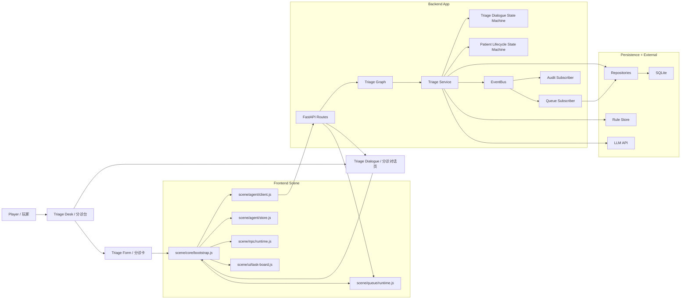
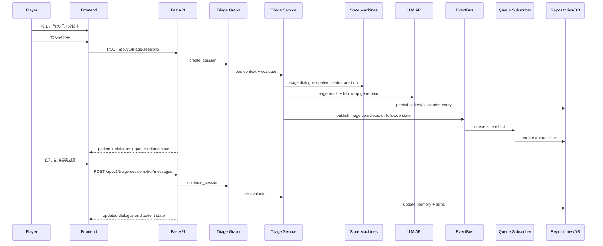

# 当前整体架构总览（用于可视化与后续协作）

## 1. 文档目的
这份文档用于总结当前项目的前端、后端、Agent 运行时、状态机、EventBus、记忆与队列系统的实际结构。

适用场景：
- 给 GPT / 其他模型生成架构图、系统图、时序图
- 给新协作者快速解释当前系统
- 作为后续新增独立 Agent（如门诊医生 Agent）的基线说明

说明：
- 本文描述的是“当前有效架构”，不是历史遗留结构。
- `scene/.history/`、旧版扁平 JS 文件只视为历史残留，不是主要维护入口。
- 当前主业务 Agent 只有一个：`triage agent`。

---

## 2. 系统一句话概述
当前系统是一个“医院分诊与排队模拟”的模块化单体应用：
- 前端使用原生 `HTML + CSS + Canvas + ES Modules`
- 后端使用 `FastAPI + LangGraph(可用) + SQLite Repository + EventBus`
- 主线业务是“玩家分诊 -> 多轮追问 -> 分诊完成 -> 自动入队 -> 前端继续展示与交互”

---

## 3. 技术栈

| 层级 | 当前技术 |
|---|---|
| 前端渲染 | HTML, CSS, Canvas |
| 前端模块化 | ES Modules |
| 前端交互 | 原生 DOM / 原生事件 |
| 后端 API | FastAPI |
| Agent 编排 | LangGraph（可用），同时保持 service/graph 分层 |
| 数据契约 | Pydantic |
| 持久化 | SQLite（通过 Repository 层封装） |
| 事件机制 | 进程内同步 EventBus |
| 状态控制 | 显式状态机 |
| LLM 调用 | 当前对接校内 GenAI API / GPT 模型 |
| 测试 | pytest + 前端模块测试文件 |

---

## 4. 当前有效目录结构

### 4.1 前端主结构
```text
scene/
  index.html
  main.js
  styles.css
  api.private.js
  core/
    bootstrap.js
  agent/
    client.js
    store.js
    triage-form.js
    triage-dialogue.js
  queue/
    runtime.js
  npc/
    runtime.js
  ui/
    task-board.js
```

### 4.2 后端主结构
```text
backend/app/
  main.py
  config.py
  database.py
  api/
    routes/
      health.py
      patients.py
      queues.py
      triage.py
  agents/
    triage/
      graph.py
      state.py
      state_machine.py
      schemas.py
      prompts.py
      rules.py
      service.py
  domain/
    patient/
      state_machine.py
  departments/
    registry.py
    internal.py
    surgery.py
    pediatrics.py
    emergency.py
    fever.py
  events/
    bus.py
    types.py
    subscribers/
      audit.py
      patient_projection.py
      queue.py
  repositories/
    patients.py
    sessions.py
    queues.py
    agent_memory.py
  schemas/
    common.py
    patient.py
    queue.py
    triage.py
```

---

## 5. 前端架构说明

## 5.1 前端总体职责
前端负责四类事情：
1. 渲染医院场景与角色
2. 管理玩家与分诊台的交互
3. 展示分诊对话、多轮追问、分诊建议
4. 展示排队队列、随机 NPC、任务板等模拟信息

## 5.2 前端模块分工

### `scene/main.js`
- 当前只是入口文件
- 主要负责导入 `core/bootstrap.js`
- 不再承载全部业务逻辑

### `scene/core/bootstrap.js`
- 当前前端的总装配入口
- 负责：
  - Canvas 场景初始化
  - 玩家移动与主循环
  - 分诊卡与分诊对话框打开/关闭
  - 键盘事件（例如 `E` 键）
  - 轮询后端患者状态和队列状态
  - 将 agent、queue、npc、ui 模块串起来
- 这是当前前端最核心的整合文件

### `scene/agent/client.js`
- 前端访问后端 API 的统一入口
- 负责请求：
  - 创建 triage session
  - 发送 follow-up message
  - 读取 patients
  - 读取 queues
- 目标是让其他前端模块不直接拼接 fetch 逻辑

### `scene/agent/store.js`
- 负责前端 agent 相关的轻状态
- 负责把后端 `dialogue.turns` 转换成前端渲染消息
- 当前支持三类 assistant message：
  - `recommendation`
  - `followup`
  - `final`
- 也负责基础去重，避免相同 recommendation 或相同 followup 重复展示

### `scene/agent/triage-form.js`
- 负责从分诊卡表单字段构建结构化 payload
- 本质上是“前端采集患者初始信息”的适配层

### `scene/agent/triage-dialogue.js`
- 负责渲染分诊对话页
- 包括：
  - 对话消息气泡
  - recommendation / followup / final 的样式差异
  - evidence chip 渲染
  - badge 渲染（Triage Level / Department）

### `scene/queue/runtime.js`
- 负责前端排队系统展示
- 包括：
  - 队列信息同步
  - 右下角队列看板绘制
  - 玩家号票状态展示

### `scene/npc/runtime.js`
- 负责随机 NPC 的生成、移动、渲染
- 当前主要用于模拟“医院大厅 / 候诊流动感”

### `scene/ui/task-board.js`
- 负责顶部任务板/工作流板展示
- 将 patient 状态与任务文本进行映射展示

## 5.3 当前前端交互主线
1. 玩家移动到分诊台附近
2. 按 `E`
3. 如果从未开始分诊：打开分诊卡
4. 如果已开始分诊：直接打开分诊对话
5. 提交分诊卡后创建 triage session
6. 前端轮询 patients / queues
7. 分诊对话页随着后端状态变化同步刷新
8. 分诊完成后继续展示 recommendation 和 queue 状态

## 5.4 当前前端的一个现实情况
虽然前端已经拆出模块，但 `scene/core/bootstrap.js` 仍然偏大，当前属于“模块化过渡态”。

因此在可视化里建议这样表达：
- `bootstrap.js` 是“前端 orchestration layer”
- 下面连接多个功能模块，而不是把它画成普通业务组件

---

## 6. 后端架构说明

## 6.1 后端总体职责
后端负责五类事情：
1. 提供统一 REST API
2. 维护 triage agent 的运行时与流程状态
3. 维护 patient / session / memory / queue 的持久化状态
4. 用状态机控制流程合法性
5. 用 EventBus 解耦“分诊完成后的副作用”

## 6.2 后端分层

### API 层：`backend/app/api/routes/`
当前对外接口：
- `POST /api/v1/triage-sessions`
- `POST /api/v1/triage-sessions/{session_id}/messages`
- `GET /api/v1/patients`
- `GET /api/v1/patients/{patient_id}`
- `GET /api/v1/queues`
- `GET /api/v1/health`

职责：
- 请求接收
- schema 校验
- 调 service
- 返回标准化 JSON

### 应用装配层：`backend/app/main.py`
职责：
- 创建 FastAPI app
- 初始化数据库
- 创建 repository / event bus / state machine / triage service
- 注册 EventBus subscriber
- 注入到 app container

这是后端的“composition root”。

### Agent 层：`backend/app/agents/triage/`
这是当前系统里唯一完整实现的 Agent 包。

分工如下：
- `graph.py`
  - 负责 triage graph 的执行顺序
  - 当前节点包括：加载上下文、评估、持久化、构建响应
- `state.py`
  - graph runtime state 定义
- `state_machine.py`
  - triage dialogue 状态机
- `prompts.py`
  - 追问 prompt 与 fallback 文案
- `rules.py`
  - 规则检索、字段解析、缺失字段排序、fallback triage
- `service.py`
  - agent 主服务编排
  - 负责融合 memory、LLM、rules、state transition、response build
- `schemas.py`
  - triage agent 相关局部 schema

### 领域状态机层：`backend/app/domain/patient/state_machine.py`
这是全局患者生命周期状态机。

它不管 prompt 和 LLM，只负责：
- 患者是否允许进入下一业务状态
- 状态迁移是否合法
- 状态对应的显示标签是什么

### Department Registry：`backend/app/departments/`
当前用于表达“科室配置 / 规则偏好”的扩展位。

目前包含：
- `internal`
- `surgery`
- `pediatrics`
- `emergency`
- `fever`

它们现在是轻量模块，不是独立服务。

### EventBus 层：`backend/app/events/`
EventBus 只负责广播已发生的事实，不负责主业务决策。

当前事件：
- `triage.completed`
- `patient.state_changed`
- `queue.ticket_created`
- `queue.ticket_called`

当前 subscriber：
- `queue.py`
  - triage 完成后创建 queue ticket
- `patient_projection.py`
  - 根据 lifecycle state 更新展示态
- `audit.py`
  - 记录审计日志

### Repository 层：`backend/app/repositories/`
负责持久化访问。

主要仓库：
- `patients.py`
- `sessions.py`
- `queues.py`
- `agent_memory.py`

职责：
- 隔离数据库细节
- 让 service / graph 不直接写 SQL
- 为未来迁移数据库实现保留接口边界

### 数据契约层：`backend/app/schemas/`
负责：
- API request/response schema
- 枚举状态
- patient / queue / triage 的公共结构

---

## 7. 当前状态机设计

## 7.1 患者生命周期状态机
定义在 `backend/app/schemas/common.py` 和 `backend/app/domain/patient/state_machine.py`。

状态：
- `untriaged`
- `triaging`
- `waiting_followup`
- `triaged`
- `queued`
- `called`
- `in_consultation`
- `completed`
- `cancelled`
- `error`

主路径：
`untriaged -> triaging -> waiting_followup -> triaged -> queued -> called -> in_consultation -> completed`

如果无需追问，则：
`untriaged -> triaging -> triaged -> queued`

## 7.2 分诊对话状态机
定义在 `backend/app/agents/triage/state_machine.py`。

状态：
- `idle`
- `collecting_initial_info`
- `evaluating`
- `needs_followup`
- `awaiting_patient_reply`
- `re_evaluating`
- `triaged`
- `failed`

主路径：
`idle -> collecting_initial_info -> evaluating -> needs_followup -> awaiting_patient_reply -> re_evaluating -> triaged`

## 7.3 状态机与 EventBus 的分工
- 状态机负责：判断能不能迁移、迁移到哪里
- EventBus 负责：迁移完成后广播事实
- Subscriber 负责：处理排队、审计、投影等副作用

也就是说：
- 状态机是“流程裁判”
- EventBus 是“广播站”
- Subscriber 是“响应执行者”

---

## 8. 当前记忆模型

## 8.1 总原则
当前记忆拆为三层：
- 共享记忆：稳定患者事实
- Agent 私有记忆：某个 Agent 的对话进度和内部状态
- 工作态：单次 graph 运行中的临时状态

## 8.2 Shared Memory
主要存：
- profile
  - 姓名
  - 年龄
  - 性别
  - 过敏史
  - 慢病
- clinical_memory
  - chief complaint
  - symptoms
  - onset_time
  - vitals
  - risk_flags
  - last_department
  - last_triage_level

## 8.3 Agent Private Memory
当前 triage agent 会维护：
- `dialogue_state`
- `assistant_message`
- `missing_fields`
- `expected_field`
- `last_question_focus`
- `last_question_text`
- `last_question_style`
- `asked_fields_history`
- `recommendation_snapshot`
- `recommendation_changed`
- `message_type`
- `latest_extraction`
- `evidence`

作用：
- 控制下一轮该问什么
- 避免 recommendation 每轮重复
- 避免同一句追问连续重复
- 给前端提供更稳定的展示信号

## 8.4 为什么这样拆
这是为了让以后新增 Agent 时不会互相污染。

例如：
- triage agent 的“下一步想问 onset_time”
- 不应该自动成为未来门诊医生 agent 的共享上下文

所以：
- 事实进 shared memory
- 过程进 agent private memory
- 推测尽量停留在 working state

---

## 9. 当前 triage agent 的运行逻辑

## 9.1 初次创建 session
1. 前端提交分诊卡
2. 后端创建 triage session
3. 患者状态进入 `triaging`
4. triage agent 加载 shared memory + private memory + 历史 turns
5. 检索规则知识
6. 调用 LLM 生成 triage result
7. 校验 result，并用 fallback rule 兜底
8. 判断是否还缺字段
9. 若缺字段，则生成 follow-up 问题
10. 若不缺，则完成 triage
11. 持久化 patient / session / memory / queue side effects

## 9.2 继续对话
1. 前端发送用户回复
2. 后端读取当前 session 和私有记忆
3. 从用户自由文本中抽取结构化字段
4. 更新 shared memory
5. 重新评估 triage
6. 决定继续追问还是完成分诊
7. 返回新的 dialogue 和 patient view

## 9.3 当前 follow-up 生成逻辑
当前追问不是完全自由聊天，而是：
- `LLM 生成 + 规则约束`
- 主追问字段必须在缺失字段中
- recommendation 如果没变，不在每轮追问里重复
- 风险高时允许先提示一句，再问单一关键问题
- 单次输出保持简短

这意味着系统更像“有边界的智能分诊问答”，不是开放聊天机器人。

---

## 10. 当前前后端联动主流程

### 主流程
1. 玩家走到分诊台附近
2. 前端按 `E`
3. 首次进入时打开分诊卡
4. 提交后创建 triage session
5. 打开分诊对话页
6. 后端返回初步 recommendation + follow-up
7. 玩家继续输入回复
8. 后端更新记忆并重新评估
9. triage 完成后发布 `triage.completed`
10. EventBus subscriber 创建 queue ticket
11. 前端继续轮询 patients / queues 并更新界面

### 当前 UI 特殊规则
- 分诊卡只在第一次触发
- 之后再次按 `E`，直接回到当前分诊聊天
- recommendation 只在首次或变化时显示

---

## 11. Agent 维护与新增 Agent 的技术约定

## 11.1 当前推荐方式
如果未来新增一个独立 Agent，例如“门诊内科医生 Agent”，推荐做法是：
1. 先定义业务边界
2. 先定义状态机
3. 再创建独立 Agent 包
4. 明确 shared memory 和 private memory 边界
5. 通过独立 API route 暴露能力
6. 只在状态迁移完成后发 EventBus 事件

## 11.2 标准 Agent 包结构
推荐位置：
```text
backend/app/agents/<agent_name>/
  graph.py
  state.py
  state_machine.py
  schemas.py
  prompts.py
  rules.py
  service.py
```

## 11.3 代码边界约束
新增 Agent 时不要：
- 直接把新逻辑塞进 `server.py`
- 直接把 prompt、SQL、API glue 写进一个文件
- 把 EventBus 当成主决策器
- 把所有 Agent 的记忆都塞进同一个共享 blob

## 11.4 维护建议
如果多人协作，建议职责拆分为：
- Agent runtime / graph
- Prompt / rule
- API / schema
- Memory / repository
- Queue / EventBus
- Frontend dialogue UI

这样可以减少多人都改同一个文件的冲突。

---

## 12. 适合 GPT 可视化的结构化描述

如果要生成一张“当前系统架构图”，建议画成下面 5 层：

### Layer 1: User / Scene Layer
- Player
- Triage Desk
- Dialogue Modal
- Queue Board
- Random NPCs

### Layer 2: Frontend Interaction Layer
- `scene/core/bootstrap.js`
- `agent/client.js`
- `agent/store.js`
- `triage-form.js`
- `triage-dialogue.js`
- `queue/runtime.js`
- `npc/runtime.js`
- `ui/task-board.js`

### Layer 3: Backend API Layer
- FastAPI App
- Triage Routes
- Patient Routes
- Queue Routes
- Health Route

### Layer 4: Backend Runtime Layer
- Triage Graph
- Triage Service
- Triage Dialogue State Machine
- Patient Lifecycle State Machine
- EventBus
- Queue Subscriber
- Patient Projection Subscriber
- Audit Subscriber

### Layer 5: Persistence / Knowledge Layer
- Patient Repository
- Session Repository
- Agent Memory Repository
- Queue Repository
- SQLite Database
- Triage Rule Store / Knowledge Rules
- LLM Endpoint

---

## 13. 推荐可视化关系（节点与边）

### 13.1 核心节点
- Player
- Scene Bootstrap
- Triage Form
- Triage Dialogue
- Backend API
- Triage Graph
- Triage Service
- Triage Dialogue State Machine
- Patient Lifecycle State Machine
- EventBus
- Queue Subscriber
- Repositories
- SQLite
- LLM API
- Queue Board
- NPC Runtime

### 13.2 核心边
- Player -> Triage Form
- Triage Form -> Backend API
- Backend API -> Triage Graph
- Triage Graph -> Triage Service
- Triage Service -> Rules
- Triage Service -> LLM API
- Triage Service -> Repositories
- Triage Service -> Dialogue State Machine
- Triage Service -> Patient State Machine
- Triage Service -> EventBus
- EventBus -> Queue Subscriber
- Queue Subscriber -> Queue Repository
- Repositories -> SQLite
- Backend API -> Frontend Dialogue
- Backend API -> Queue Board
- Bootstrap -> Queue Runtime
- Bootstrap -> NPC Runtime

---

## 14. Mermaid：系统总览图



---

## 15. Mermaid：分诊时序图



---

## 16. 可直接给 GPT 出图的简化提示词
下面这段文字可以直接作为可视化模型的输入基础：

> 请画一张“医院分诊与排队模拟系统”的软件架构图。系统分为五层：第一层是玩家与医院场景，包括分诊台、分诊卡、分诊对话页、队列看板和随机 NPC；第二层是前端交互层，包括 bootstrap、agent client、agent store、triage form、triage dialogue、queue runtime、npc runtime 和 task board；第三层是后端 API 层，使用 FastAPI，对外提供 triage session、patient、queue 和 health 接口；第四层是后端运行时层，包括 triage graph、triage service、triage dialogue state machine、patient lifecycle state machine、EventBus、queue subscriber 和 audit subscriber；第五层是数据与外部服务层，包括 repositories、SQLite、rule store 和 LLM API。请突出主流程：玩家提交分诊卡后，后端创建 triage session，triage agent 进行多轮追问与分诊，分诊完成后通过 EventBus 自动创建 queue ticket，前端持续轮询并更新分诊对话与排队看板。图风格要求清晰、工程化、模块边界明确、箭头方向清楚。

---

## 17. 一句话结论
当前项目已经不是“前端大脚本 + 后端单文件”的原型，而是一个带有：
- 模块化前端
- FastAPI 后端
- triage agent graph
- 双状态机
- EventBus
- Repository 持久化
- 多轮分诊对话
- 自动排队联动
的可持续扩展基础架构。
